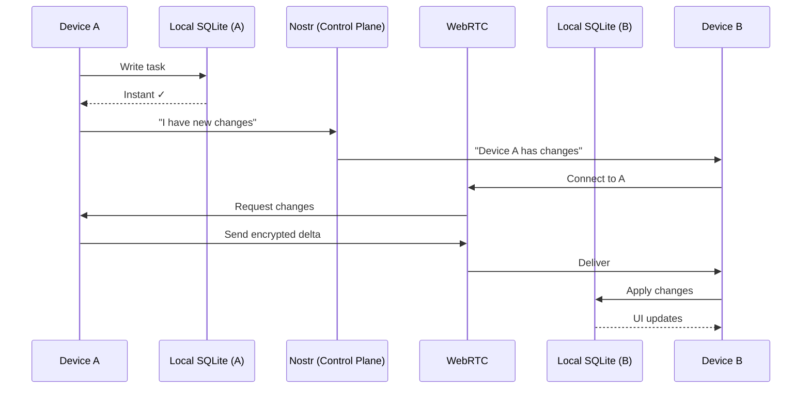

# LocalSync: Product Vision

> **One-liner**: LocalSync is a local-first sync SDK that lets developers build apps like Notion, Linear, or Obsidian—without running any backend.

---

## The Problem

### What developers face today

Building a real-time collaborative app with offline support is **hard**:

1. **Backend complexity**: You need servers for auth, data storage, sync, and conflict resolution
2. **Operational burden**: Servers mean uptime, scaling, security patches, and costs
3. **Sync is unsolved**: Getting offline-first sync right with conflict resolution is PhD-level work
4. **Privacy concerns**: Users increasingly want to own their data, not store it on your servers

### The current landscape

| Approach | Drawback |
|----------|----------|
| **Firebase/Supabase** | Vendor lock-in, your data = their data, recurring costs |
| **Roll your own** | 6-12 months of engineering, ongoing maintenance |
| **CRDTs (Yjs, Automerge)** | Great for documents, harder for relational data + queries |
| **Local-only (SQLite)** | No sync, no sharing, single device |

Developers are forced to choose between **operational complexity** or **limited functionality**.

---

## The Solution

### What LocalSync is

**LocalSync is a sync layer, not a backend.**

```
┌─────────────────────────────────────────────────────────────┐
│                     Your App (Web/Desktop)                  │
├─────────────────────────────────────────────────────────────┤
│                       LocalSync SDK                         │
│  ┌─────────┐  ┌─────────┐  ┌─────────┐  ┌───────────────┐  │
│  │ SQLite  │  │  Vault  │  │  Sync   │  │ Control Plane │  │
│  │ (CRDT)  │  │ (Keys)  │  │ (P2P)   │  │   (Nostr)     │  │
│  └─────────┘  └─────────┘  └─────────┘  └───────────────┘  │
├─────────────────────────────────────────────────────────────┤
│       Local Storage (OPFS / FS)  ←→  Peer Devices           │
└─────────────────────────────────────────────────────────────┘
```

### Core principles

| Principle | What it means |
|-----------|--------------|
| **Local-first** | All reads and writes are instant (local). Sync is opportunistic. |
| **No required server** | Works from static hosting (GitHub Pages, Vercel) |
| **Peer-to-peer sync** | Devices sync directly via WebRTC when online |
| **SQL as the API** | Familiar relational model, not opaque documents |
| **Secure by default** | End-to-end encryption for shared spaces |

---

## Why LocalSync

### For developers

| Benefit | Impact |
|---------|--------|
| **Zero backend** | Deploy to static hosting. No servers to run or scale. |
| **Instant UX** | Local reads/writes = 0ms latency. Users love it. |
| **SQL queries** | Use familiar SQLite. Reactive `watch()` for real-time UI. |
| **Works offline** | Full functionality without internet. Sync when connected. |
| **Collaboration built-in** | Shared spaces with membership and permissions. |

### For users

| Benefit | Impact |
|---------|--------|
| **Own your data** | Data lives on your devices, not someone's cloud |
| **Privacy** | End-to-end encryption for shared content |
| **Works anywhere** | Airplane, subway, cabin—no internet required |
| **Fast** | No round-trips to servers |

---

## What You Can Build

LocalSync enables a new category of apps: **personal software that can optionally collaborate**.

### Example use cases

```
┌────────────────────────────────────────────────────────────────┐
│  PERSONAL PRODUCTIVITY                                         │
│  • Notes app (Obsidian-like)                                   │
│  • Task manager (Todoist-like)                                 │
│  • Journal                                                     │
│  • Personal CRM                                                │
├────────────────────────────────────────────────────────────────┤
│  TEAM COLLABORATION                                            │
│  • Project management (Linear-like)                            │
│  • Wiki / Knowledge base (Notion-like)                         │
│  • Kanban boards (Trello-like)                                 │
│  • Shared lists                                                │
├────────────────────────────────────────────────────────────────┤
│  SPECIALIZED TOOLS                                             │
│  • Inventory management                                        │
│  • Field data collection                                       │
│  • Recipe manager                                              │
│  • Reading list / Bookmarks                                    │
└────────────────────────────────────────────────────────────────┘
```

---

## How It Works

### The 3-minute overview



1. **You write locally** → instant
2. **You announce on Nostr** → "I have changes"
3. **Peers connect via WebRTC** → direct, encrypted
4. **Delta sync** → only what's changed
5. **Merge automatically** → CR-SQLite handles conflicts

### Key technical choices

| Component | Technology | Why |
|-----------|------------|-----|
| **Database** | SQLite + CR-SQLite | Proven, relational, automatic conflict resolution |
| **Control plane** | Nostr | Decentralized, no account needed, censorship-resistant |
| **Data plane** | WebRTC | Direct P2P, encrypted, works through NATs |
| **Encryption** | XChaCha20-Poly1305 | Modern, fast, secure |

---

## Target Audience

### Primary: Indie developers & small teams

- Building productivity tools, personal software, or SaaS
- Want offline-first without building sync infrastructure
- Value simplicity over vendor dependencies

### Secondary: Enterprise teams

- Need on-premise/self-hosted data options
- Compliance requirements (GDPR, HIPAA data locality)
- Want to reduce cloud costs and complexity

---

## What Success Looks Like

### v0.1 (MVP) — "It works"
- [ ] Single-user, multi-device sync (personal spaces)
- [ ] SQLite + CR-SQLite on web + Node/Electron
- [ ] WebRTC sync with Nostr discovery
- [ ] Basic reactive queries

### v0.2 — "It collaborates"
- [ ] Shared spaces with membership
- [ ] End-to-end encryption
- [ ] Invite flow via Nostr
- [ ] Permission policies

### v0.3 — "It scales"
- [ ] Optional relay transport for reliability
- [ ] Blob/file attachments
- [ ] Presence indicators
- [ ] Key rotation on member removal

### v1.0 — "It's production-ready"
- [ ] Mobile support (React Native / Capacitor)
- [ ] Migration tooling
- [ ] Optional cloud backup adapters
- [ ] Push notifications (optional gateway)

---

## Competitive Positioning

```
                    ┌─────────────────────────────────────────────┐
                    │           DATA OWNERSHIP                    │
                    │                                             │
                    │   You own it          They own it           │
                    │       ◄─────────────────────►               │
                    │                                             │
    ┌───────────────┼──────────────────┬────────────────────────┼┐
    │ Full          │                  │                        ││
    │ Offline       │   ★ LocalSync    │                        ││
    │               │                  │      Notion            ││
    │       ▲       │   Obsidian       │      Linear            ││
    │       │       │   (local-only)   │      Figma             ││
    │  O    │       │                  │                        ││
    │  F    │       ├──────────────────┼────────────────────────┤│
    │  F    │       │                  │                        ││
    │  L    │       │                  │      Firebase          ││
    │  I    │       │                  │      Supabase          ││
    │  N    │       │                  │      Convex            ││
    │  E    │       │                  │                        ││
    │       │       │                  │                        ││
    │       ▼       │                  │                        ││
    │ Online only   │                  │                        ││
    └───────────────┼──────────────────┴────────────────────────┼┘
                    │                                             │
                    └─────────────────────────────────────────────┘
```

LocalSync sits in the **underserved quadrant**: full offline support + user data ownership.

---

## The Big Picture

LocalSync is part of a broader shift toward **local-first software**:

> "Cloud software has made us dependent on services that can disappear, change pricing, or lock us out. Local-first software returns control to users while keeping the collaborative benefits of the cloud."

We're building the **infrastructure layer** that makes it easy for any developer to join this movement.

---

## Get Started

```ts
import { LocalSync } from 'localsync';

const client = await LocalSync.open({ appId: 'my-app' });
const session = await client.login(pubkey, password);
const space = await session.spaces.createPersonal();

// Write data (instant, local)
await space.run(`INSERT INTO notes(id, title) VALUES(?, ?)`, [id, 'Hello']);

// Reactive query
space.watch(`SELECT * FROM notes`, [], (rows) => {
  render(rows); // Re-renders on local changes AND sync from other devices
});

// Sync with peers (automatic when online)
await space.sync.start();
```

**No servers. No accounts. No cost. Just code.**

---

## Links

- [Technical Spec](./technical_spec.md) — Implementation details
- [Protocol Spec](./spec_consolidated.md) — Full protocol reference
- [GitHub](#) — Source code (coming soon)

---

*LocalSync: Build apps that work everywhere, sync automatically, and respect user privacy.*
